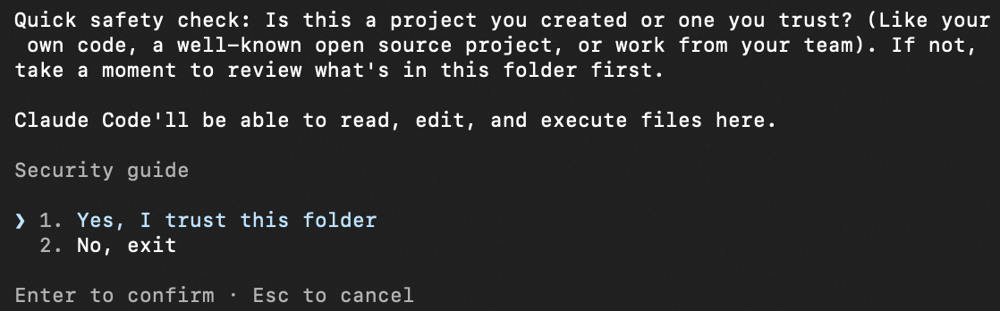
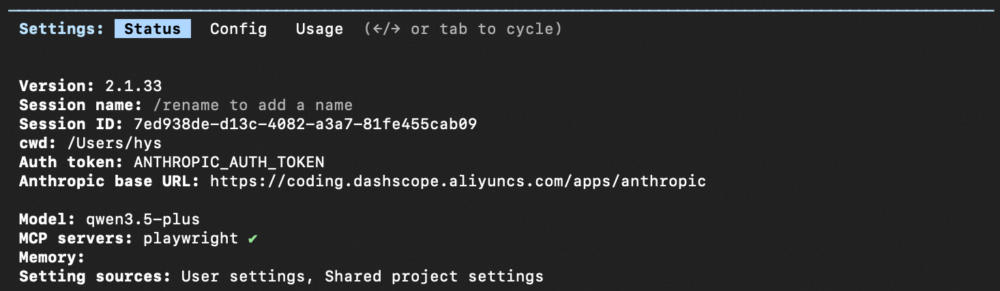
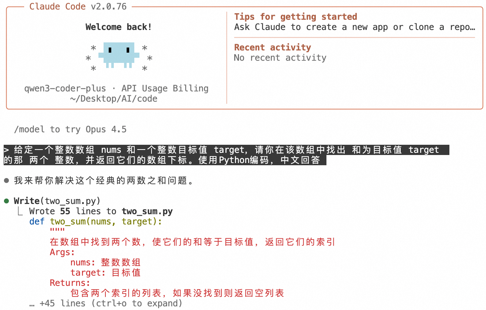

+++
date = '2026-03-03T00:00:00+08:00'
draft = false
title = 'claude code安装教程'
tags = ['开发工具', '教程']
+++

# Claude Code 安装教程

Claude Code 是一个强大的 AI 编程助手，可以帮助你更高效地开发代码。本教程将指导你完成安装过程。

## 安装 Claude Code

### macOS/Linux/Windows

1. 安装或更新 Node.js（v18.0 或更高版本）。

2. 在终端中执行下列命令，安装 Claude Code。

   ```
   npm install -g @anthropic-ai/claude-code
   ```

3. 运行以下命令验证安装。若有版本号输出，则表示安装成功。

   ```
   claude --version
   ```

## 在 Claude Code 中接入国产模型

需要配置以下信息：

- **ANTHROPIC_BASE_URL**：设置为模型地址
- **ANTHROPIC_AUTH_TOKEN**：设置为 API Key
- **ANTHROPIC_MODEL**：设置为供应商支持的模型

### macOS/Linux/Windows

1. 创建并打开配置文件 `~/.claude/settings.json`。

   `~` 代表用户主目录。如果 `.claude` 目录不存在，需要先行创建。可在终端执行 `mkdir -p ~/.claude` 来创建。

   ```
   nano ~/.claude/settings.json
   ```

2. 编辑配置文件。

   ```json
   {
       "env": {
           "ANTHROPIC_AUTH_TOKEN": "YOUR_API_KEY",
           "ANTHROPIC_BASE_URL": " ",
           "ANTHROPIC_MODEL": " "
       }
   }
   ```

3. 保存配置文件，重新打开一个终端即可生效。

4. 编辑或新增 `~/.claude.json` 文件，将 `hasCompletedOnboarding` 字段的值设置为 `true` 并保存文件。

   ```json
   {
     "hasCompletedOnboarding": true
   }
   ```

   注意：`hasCompletedOnboarding` 作为顶层字段，请勿嵌套于其他字段。该步骤可避免启动 Claude Code 时报错：Unable to connect to Anthropic services。

## 使用 Claude Code

1. 打开终端，并进入项目所在的目录。运行以下命令启动程序 Claude Code：

   ```
   cd path/to/your_project
   claude
   ```

2. 启动后，需要授权 Claude Code 执行文件。
检查以下图片加载方式是否正确              


3. 输入 `/status` 确认模型、Base URL、API Key 是否配置正确。


4. 恭喜你，在 Claude Code 中开始对话吧。

## 切换模型

- **启动时切换**：在终端执行 `claude --model <模型名称>` 指定模型并启动 Claude Code，例如 `claude --model qwen3-coder-next`。

- **会话期间**：在对话框输入 `/model <模型名称>` 命令切换模型，例如 `/model qwen3-coder-next`。

## 权限系统的设置
这是 Claude Code 最烦人的地方：它对每件事都要请求权限。

有一个解决方案：
`claude --dangerously-skip-permissions`
通过这条命令启动claude，会自动同意所有的权限请求！

## 常见命令

| 命令       | 说明                                                                 | 示例                  |
|------------|----------------------------------------------------------------------|-----------------------|
| `/init`    | 在项目根目录生成 CLAUDE.md 文件，用于定义项目级指令和上下文。       | `/init`               |
| `/status`  | 查看当前模型、API Key、Base URL 等配置状态。                         | `/status`             |
| `/model <模型名称>` | 切换模型。                                                       | `/model qwen3-coder-next` |
| `/clear`   | 清除对话历史，开始全新对话。                                         | `/clear`              |
| `/plan`    | 进入规划模式，仅分析和讨论方案，不修改代码。                         | `/plan`               |
| `/compact` | 压缩对话历史，释放上下文窗口空间。                                   | `/compact`            |
| `/config`  | 打开配置菜单，可设置语言、主题等。                                   | `/config`             |

更多命令与用法详情，请参考 Claude Code 官方文档。

## 能力扩展

Claude Code 支持通过 MCP 和 Skills 扩展自身能力，例如调用联网搜索获取实时信息、使用图片理解 Skill 分析图像内容等。详情请参考最佳实践。


## 获取帮助

- **官方文档**：访问 Anthropic 官网的文档页面
- **社区论坛**：在 GitHub Discussions 中提问
- **问题报告**：在 GitHub Issues 中报告 bug

## 总结

Claude Code 是一个功能强大的编程辅助工具，通过上述步骤的安装和配置，你就可以开始使用它来提高编程效率。如果在使用过程中遇到问题，建议查阅官方文档或社区资源。

祝你使用愉快！